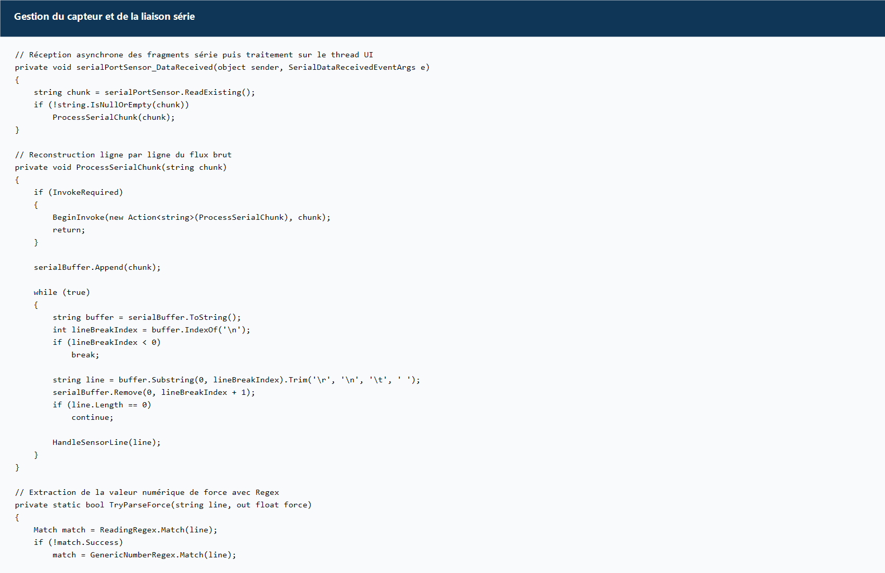
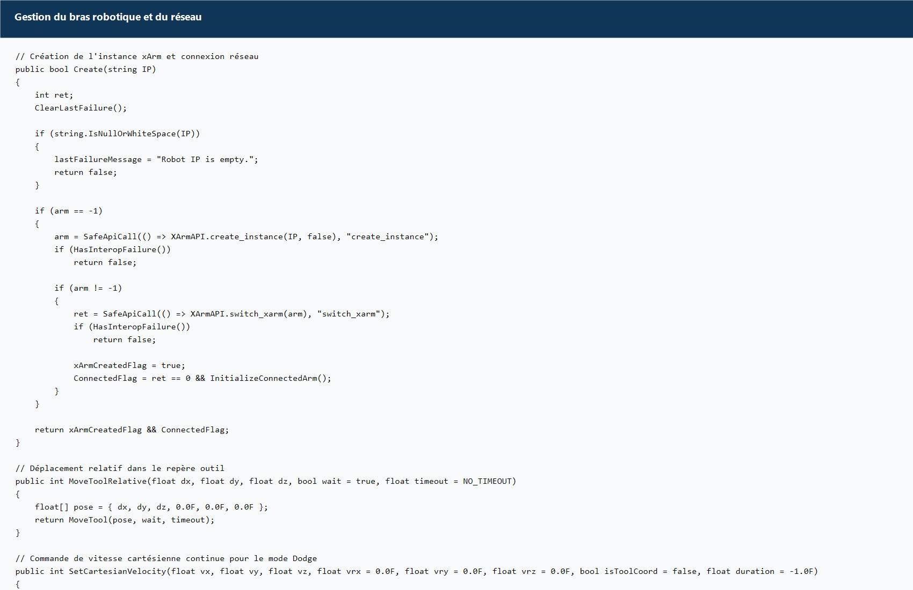
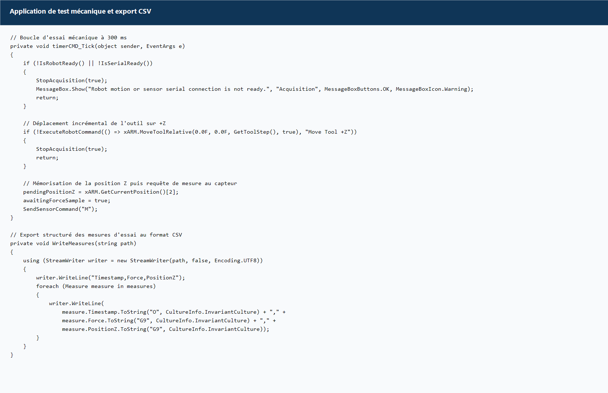
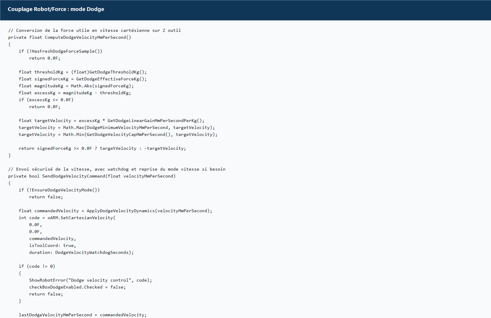

# Rapport CSM Robot + Force

**Module :** Conception des systemes mecatroniques  
**Equipe :** Harambat Martin / Orhategaray Eneko / Larregle Achille / Kam Melvyn

## Introduction

Ce rapport presente l'etat reel du projet local `CSM`, centre sur l'integration d'un capteur de force externe et d'un bras robotique xArm6 dans une application unique developpee en C# WinForms. L'objectif pedagogique du projet est double : d'une part maitriser la communication serie avec un capteur de force, et d'autre part piloter un robot industriel sur le reseau, afin de construire un comportement couple entre mesure d'effort et mouvement.

L'analyse qui suit est volontairement stricte et honnete. Elle s'appuie uniquement sur le code effectivement present dans le depot local et sur les fonctions observables dans les projets `RobotForceIntegration` et `RS232-PC`. En consequence, le rapport distingue clairement les parties deja implementees, les comportements reellement observables dans le code, et les points qui relevent encore d'une validation experimentale ou d'un approfondissement futur.

## Description rapide de l'IHM

L'interface principale est portee par un formulaire WinForms unique, structure en plusieurs blocs fonctionnels. Cette organisation permet de regrouper dans une meme fenetre le pilotage du robot, la gestion du capteur de force, l'acquisition de donnees et l'affichage des evenements systeme.

Le bloc **Robot** contient la saisie de l'adresse IP, le bouton de connexion, l'activation du mouvement, la sensibilite de collision, le reglage global de vitesse et la gestion de la detection d'auto-collision. Le bloc **Robot State** affiche l'etat instantane du robot au travers de deux champs principaux : les positions articulaires et la position cartesienne courante.

Deux zones de commande manuelle sont dediees au deplacement. Le bloc **Tool Motion** permet d'envoyer des deplacements relatifs dans le repere outil, avec un pas reglable par curseur. Le bloc **Joint Motion** autorise les deplacements articulation par articulation avec un pas angulaire configurable. Le bloc **Sensor** regroupe la configuration de la liaison serie, l'ouverture et la fermeture du port, l'envoi manuel de commandes ainsi que l'operation de tare.

Le bloc **Acquisition** permet de choisir un fichier CSV, de lancer un essai mecanique et d'enregistrer ensuite les mesures. Enfin, un bloc **Dodge** active un comportement reactif fonde sur la force mesuree, avec un seuil reglable, tandis que le **journal d'evenements** conserve la chronologie textuelle des operations effectuees par l'application.

## Gestion du capteur et de la liaison serie

La communication avec le capteur repose sur le composant `System.IO.Ports.SerialPort`. La configuration serie est accessible depuis l'IHM et inclut le port COM, le debit, la parite, le nombre de bits de donnees et les bits de stop. Dans la configuration observee dans le code, la vitesse de transmission par defaut est fixee a `115200` bauds, avec une terminaison de ligne `\r\n`.

L'ouverture effective du port s'effectue via le bouton `Open`, apres application des parametres choisis. La reception est asynchrone : lorsqu'un nouveau fragment de donnees arrive, l'evenement `DataReceived` lit le contenu disponible dans le buffer serie, puis le transmet a une fonction de traitement qui reconstitue les lignes completes avant de les analyser.

Le parsing de la mesure repose sur une expression reguliere, chargee d'extraire la valeur numerique utile de la chaine retournee par le capteur. Dans l'application integree, la commande `M` sert a demander une mesure, tandis que la commande `T` est utilisee pour lancer une tare. Une fois la valeur extraite, elle est stockee comme force courante. Dans le mode reactif `Dodge`, cette force est en plus filtree pour limiter les variations brusques et eviter un comportement instable.

Le projet `RS232-PC` sert egalement de base de reference pour cette brique. Il montre une architecture comparable : configuration du port, ouverture et fermeture, reception asynchrone, parsing des lignes et ecriture d'un CSV. Cette coherence entre l'outil de demonstration serie et l'application integree confirme que la partie capteur est structuree autour d'un schema robuste et reutilisable.

## Gestion du bras robotique et du reseau

Le robot xArm6 est pilote par le reseau local au moyen de la bibliotheque native `xarm.dll`, appelee depuis C# via `DllImport` dans `XArmAPI.cs`. La classe `Robot` encapsule cette couche native afin de proposer une interface plus simple au reste de l'application : creation d'instance, connexion robot, activation du mouvement, preparation des modes de commande, lecture de la pose et envoi des deplacements.

La connexion reseau suit plusieurs etapes. L'application tente d'abord de creer une instance xArm a partir de l'adresse IP fournie, puis d'activer cette instance et d'initialiser le robot en lisant sa position, ses angles articulaires et ses parametres de collision. Le code local inclut desormais un diagnostic plus explicite des erreurs natives, ce qui permet de distinguer un probleme de connexion reseau d'un probleme de chargement de la DLL ou d'incompatibilite native.

Une fois connecte, le robot peut etre utilise dans plusieurs modes. Le mode nominal emploie des mouvements cartesiens relatifs dans le repere outil, des mouvements cartesiens dans le repere base, ainsi que des mouvements articulaires. Le code prevoit egalement un mode de vitesse cartesienne continue, utilise dans le comportement `Dodge`. La vitesse et l'acceleration globales sont ajustees a partir d'un curseur utilisateur, puis propagees vers les parametres internes du robot.

## Couplage Robot / Force

Le couplage Robot / Force existe dans le code local sous deux formes distinctes qu'il convient de ne pas confondre.

La premiere forme correspond au **mode d'acquisition mecanique**. Un timer cadence a `300 ms` declenche successivement un deplacement relatif du robot sur l'axe `+Z`, la lecture de la position atteinte, puis l'envoi d'une requete de mesure `M` au capteur. Lorsque la reponse serie est recue et analysee, le couple `(Force, PositionZ)` est memorise dans une liste de mesures. Cette logique constitue une sequence d'essai mecanique automatisee, adaptee a la construction d'une courbe force-deplacement.

La seconde forme correspond au **mode Dodge**. Dans ce cas, un timer plus rapide, regle a `50 ms`, interroge le capteur tant que le mode est actif. La force lue est filtree, comparee a un seuil reglable, puis convertie en vitesse cartesienne sur l'axe `Z` du repere outil. Cette commande de vitesse est ensuite envoyee au robot au moyen des fonctions de vitesse cartesienne continue. Le comportement obtenu est reactif et vise a eloigner ou accompagner l'outil selon le signe et l'intensite de la force mesuree.

Ces deux mecanismes relevent tous deux d'un couplage entre le robot et la mesure de force, mais ils repondent a des usages differents : le premier sert principalement a l'essai mecanique et a l'enregistrement des donnees ; le second sert a generer un comportement reactif de securite ou d'assistance au mouvement.

## Asservissement en force

Dans un sens academique strict, le code local ne met pas encore en oeuvre une boucle complete d'asservissement en force validee experimentalement pour maintenir une force cible nulle. Il existe cependant un comportement approchant, implemente dans le mode `Dodge`, qui transforme la force mesuree en une vitesse cartesienne sur `Z` apres application d'un seuil, d'un filtrage, d'une saturation et de garde-fous temporels.

Cette logique doit donc etre decrite comme un **comportement reactif en effort**, et non comme un asservissement en force pleinement valide au sens d'un correcteur formel identifie et teste sur une campagne complete d'essais. Le depot montre bien la presence de mecanismes de filtrage, de seuils, de limitation de vitesse et de watchdog, mais il ne documente pas a lui seul une validation experimentale exhaustive d'une regulation de force a consigne nulle.

Il est important de noter que la bibliotheque xArm expose egalement, dans `XArmAPI.cs`, des fonctions avancees liees a l'impedance et au controle de force natif du robot. Neanmoins, dans l'application etudiee ici, le comportement effectivement utilise repose sur la mesure du capteur externe et une commande de vitesse cartesienne calculee cote PC.

## Application de test mecanique

L'application integre un mode d'acquisition specifiquement destine aux essais mecaniques. L'utilisateur choisit d'abord le fichier CSV de sortie, puis lance l'essai. Tant que l'acquisition est active, le timer d'essai provoque un increment de deplacement sur `Z`, demande une nouvelle mesure de force et stocke les valeurs successives.

Le CSV produit par l'application contient trois colonnes : `Timestamp`, `Force` et `PositionZ`. L'ecriture est realisee en `UTF-8`, avec un formatage invariant pour garantir un separateur decimal stable. En cas de conflit d'acces sur le fichier cible, le logiciel genere un chemin de secours afin d'eviter la perte des donnees. Cette fonctionnalite rend l'outil exploitable pour des campagnes d'essais simples, a condition que le capteur et le robot soient tous deux operationnels pendant l'acquisition.

Le code local ne permet pas, a lui seul, d'affirmer que l'ensemble de la chaine a deja ete valide sur une campagne experimentale complete. En revanche, il montre bien que l'architecture logicielle de l'essai mecanique est implemente : selection du fichier, sequence robot, acquisition de la force et export structure des mesures.

## Extraits et captures de code commentes

Les pieces jointes fournies avec ce rapport contiennent des captures de code commentees portant sur les themes imposes :

- traitement du flux serie et parsing de la force ;
- connexion reseau robot et encapsulation xArm ;
- boucle d'acquisition mecanique a `300 ms` ;
- comportement `Dodge` en vitesse cartesienne.

Ces captures sont placees dans le dossier `Rapport_CSM_Robot_Force_assets/code_captures/` et peuvent etre inserees directement dans le dossier ZIP final.

### Capture 1 : traitement serie et extraction de la force

### Capture 2 : gestion du robot et de la couche reseau

### Capture 3 : sequence d'essai mecanique et export CSV

### Capture 4 : comportement reactif `Dodge`

## Fichiers complementaires joints au rendu

Afin de satisfaire l'ensemble du cahier des charges, le present rapport est accompagne des fichiers suivants :

- un fichier texte listant les fonctions pertinentes du projet : `Rapport_CSM_Robot_Force_assets/fonctions_pertinentes.txt` ;
- un exemple de fichier de test au format CSV : `Rapport_CSM_Robot_Force_assets/exemple_test_force_position.csv` ;
- des captures de code commentees dans `Rapport_CSM_Robot_Force_assets/code_captures/` ;
- un script de generation du PDF : `build_Rapport_CSM_Robot_Force_pdf.ps1`.

## Validation et limites

Le depot local atteste de l'existence d'une application integree coherente, compilable et structuree autour de briques clairement identifiees : IHM, communication serie, communication reseau, acquisition mecanique et mode reactif base sur la force. En ce sens, le projet constitue une base serieuse pour un rendu de module CSM.

Neanmoins, certaines limites doivent etre formulees explicitement pour conserver un niveau academique satisfaisant. D'une part, la distinction entre essai mecanique et comportement reactif doit etre maintenue, car les deux mecanismes repondent a des finalites differentes. D'autre part, le depot ne demontre pas a lui seul qu'une boucle complete d'asservissement en force a consigne nulle a ete validee experimentalement sur le robot reel. Enfin, l'unite exacte de la force enregistree depend du protocole effectif du capteur ; dans le code observe, le seuil `Dodge` est exprime en kilogrammes, tandis que le CSV stocke simplement la valeur de force brute sans unite explicite dans son en-tete.

## Conclusion

Le projet local `CSM` presente une integration logicielle credible entre un capteur de force externe et un robot xArm6. L'application WinForms centralise les fonctions essentielles d'un banc d'essai mecatronique : connexion au robot, communication serie avec le capteur, acquisition de mesures, export CSV, deplacement manuel et mode reactif base sur l'effort.

Dans sa forme actuelle, le code implemente clairement une application de test mecanique et un comportement de reaction a la force, mais il ne convient pas de presenter cet ensemble comme un asservissement en force completement valide au sens academique strict. Cette distinction renforce la credibilite du rendu et permet de livrer un rapport professionnel, fidele au travail reellement observable dans le depot.
